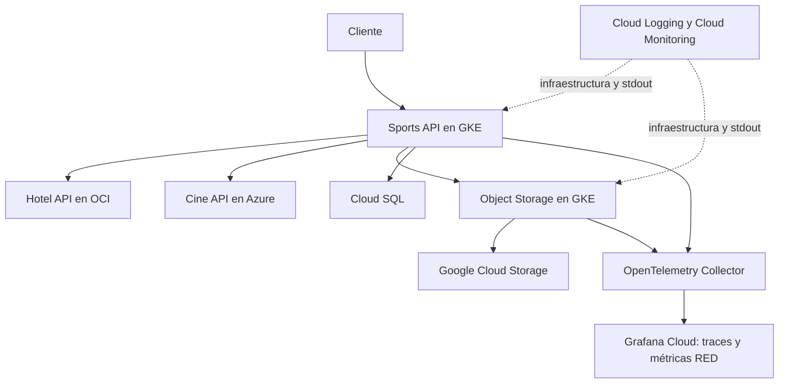

# Sports Tournaments API

Este repositorio contiene la evolución del proyecto académico de torneos deportivos, desde la API base de la primera entrega hasta la V2 desplegada en la parte GCP de una arquitectura multicloud.

- **Entrega 1:** API REST de torneos deportivos, con entidades propias, MySQL, Docker y pipelines de CI.
- **Entrega 2:** el mismo repositorio añade `/api/v2`, integración en tiempo real con las API de Hotel y Cine, Kubernetes en GKE, un servicio de Object Storage sobre Google Cloud Storage y observabilidad.

La Entrega 2 no sustituye las rutas originales. Las conserva y agrega la superficie `/api/v2`.

El campo `version` de `package.json` sigue en `1.0.0`. “API V2” se refiere al prefijo HTTP `/api/v2`, no a un release SemVer 2.0.0.

## Evolución del proyecto

| Característica | Entrega 1 | Entrega 2 |
|---|---|---|
| Versión API | Rutas sin versión: `/torneos`, `/canchas`, `/jugadores` | Esas rutas se mantienen y se vuelven a publicar bajo `/api/v2`. Se agrega el flujo multicloud |
| Arquitectura interna | Fastify, controladores, servicios y entidades TypeORM | La misma estructura, más clientes HTTP hacia Hotel, Cine y Object Storage |
| Entidades | Torneo, Cancha y Jugador, persistidas en MySQL | Las tres entidades locales se mantienen. Habitación y Película no se guardan en la base de Sports |
| Persistencia | MySQL 8.4 | MySQL para desarrollo local; en GKE, Cloud SQL mediante Cloud SQL Auth Proxy |
| Despliegue | Docker, Docker Compose y CI en GitHub Actions. El README de esa entrega documentaba Railway para Testing y Production | Manifiestos en `k8s/` para GKE: Sports API, Object Storage y OpenTelemetry Collector. Los workflows actuales no despliegan a GKE |
| Integración con APIs externas | No | Sports consulta Hotel y Cine por HTTP y envía el resultado a Object Storage |
| Kubernetes | No | Deployment, Service, ConfigMap, probes, requests/limits, réplicas, HPA de Sports, Secret Manager CSI y Cloud SQL Proxy |
| Object Storage | No | Servicio independiente en GKE. Sports no escribe en GCS directamente |
| Observabilidad | Logger de Fastify hacia stdout | Logs de stdout en Cloud Logging. Métricas de infraestructura en Cloud Monitoring. Traces y métricas RED en Grafana Cloud |
| Trazabilidad | No había `x-trace-id` ni OpenTelemetry en la API documentada | `x-trace-id` en `/api/v2`, spans de servidor y de cliente, propagación W3C y spans de GCS |
| Configuración | `DB_HOST`, `DB_PORT`, `DB_USER`, `DB_PASSWORD`, `DB_NAME` | Esas variables se conservan. Se agregan URLs de integración, Cloud SQL y `DB_PASSWORD_FILE`. Object Storage usa `GCS_BUCKET_NAME` |

Lo que todavía es responsabilidad de otros integrantes y no está integrado de extremo a extremo en este repositorio no aparece en la columna Entrega 2 como hecho. Está en [Integración grupal pendiente](#integración-grupal-pendiente).

# Entrega 1

API RESTful para la gestión de torneos deportivos. Permite administrar torneos, canchas y jugadores mediante operaciones CRUD y filtros de consulta. Incluía pruebas automatizadas, cobertura de código, Docker y pipelines independientes de CI para Testing y Production.

Esta sección describe lo que correspondía a esa entrega. Health checks, `/api/v2`, Kubernetes, Object Storage y OpenTelemetry no formaban parte de ella.

## Propósito y stack

- Node.js 22
- TypeScript
- Fastify
- TypeORM
- MySQL 8.4
- Docker y Docker Compose
- Vitest
- GitHub Actions

La aplicación también expone `GET /`, que responde un mensaje de disponibilidad de la API.

## Entidades

### Torneo

Nombre, deporte, fecha de inicio, fecha de fin y estado. El estado por defecto en la entidad es `PROGRAMADO`. Tabla `torneos`.

### Cancha

Nombre, ubicación, tipo de superficie y disponibilidad. Tabla `canchas`.

### Jugador

Nombre, documento, fecha de nacimiento y posición. El documento es único. Tabla `jugadores`.

## API original

Estas rutas siguen existiendo en la raíz de la aplicación.

### Torneos

| Método | Ruta | Propósito |
|---|---|---|
| POST | `/torneos` | Crear torneo |
| GET | `/torneos` | Consultar torneos |
| GET | `/torneos/:id` | Consultar torneo por ID |
| PATCH | `/torneos/:id` | Actualizar torneo |
| DELETE | `/torneos/:id` | Eliminar torneo |

Filtros: `deporte`, `estado`. Se pueden combinar.

```http
GET /torneos?deporte=Futbol
GET /torneos?estado=PROGRAMADO
GET /torneos?deporte=Futbol&estado=PROGRAMADO
```

### Canchas

| Método | Ruta | Propósito |
|---|---|---|
| POST | `/canchas` | Crear cancha |
| GET | `/canchas` | Consultar canchas |
| GET | `/canchas/:id` | Consultar cancha por ID |
| PATCH | `/canchas/:id` | Actualizar cancha |
| DELETE | `/canchas/:id` | Eliminar cancha |

Filtros: `tipoSuperficie`, `disponible`. Se pueden combinar.

```http
GET /canchas?tipoSuperficie=Sintetica
GET /canchas?disponible=true
GET /canchas?tipoSuperficie=Sintetica&disponible=true
```

### Jugadores

| Método | Ruta | Propósito |
|---|---|---|
| POST | `/jugadores` | Crear jugador |
| GET | `/jugadores` | Consultar jugadores |
| GET | `/jugadores/:id` | Consultar jugador por ID |
| PATCH | `/jugadores/:id` | Actualizar jugador |
| DELETE | `/jugadores/:id` | Eliminar jugador |

Filtros: `nombre`, `posicion`. Se pueden combinar.

```http
GET /jugadores?nombre=Juan
GET /jugadores?posicion=Delantero
GET /jugadores?nombre=Juan&posicion=Delantero
```

## Persistencia y ejecución local

La conexión local usa MySQL. Las variables de esa entrega están en `.env.example`:

```env
DB_HOST=
DB_PORT=
DB_USER=
DB_PASSWORD=
DB_NAME=
```

`docker-compose.yml` levanta MySQL 8.4 y la API. Los datos de MySQL se conservan en un volumen de Docker.

```bash
docker compose up --build
```

Servicios locales previstos por Compose:

```text
API:   http://localhost:3000
MySQL: localhost:3306
```

```bash
docker compose down
```

Compose, en su forma actual, solo inyecta la configuración de base de datos. No configura Hotel, Cine, Object Storage ni OpenTelemetry, así que no ejecuta el flujo multicloud de la Entrega 2.

## Pruebas y quality gates documentados

Comandos de la API principal:

```bash
npm test
npm run test:coverage
npm run test:coverage:testing
npm run test:coverage:production
```

El README de la Entrega 1 reportaba 30 pruebas automatizadas de las rutas de torneos, canchas y jugadores, y esta cobertura:

| Métrica | Cobertura |
|---|---:|
| Statements | 93.2 % |
| Branches | 100 % |
| Functions | 90 % |
| Lines | 93.2 % |

Umbrales configurados en los scripts de cobertura:

- Testing: 60 %
- Production: 85 %

Esas cifras describen el estado documentado de la Entrega 1. La suite creció después con flujo, Object Storage y observabilidad. Este README no actualiza el conteo.

## Ramas y CI

```text
develop → Testing
main    → Production
```

Workflows:

- `.github/workflows/testing.yml`, en push a `develop` o `workflow_dispatch`, environment `testing`
- `.github/workflows/production.yml`, en push a `main` o `workflow_dispatch`, environment `production`

Cada workflow ejecuta, en ese orden: checkout, Node.js 22, `npm ci`, build, `npm test` y el quality gate de cobertura correspondiente. No contienen un job de despliegue a GKE.

La Entrega 1 documentaba dos ambientes en Railway, cada uno con su API y su MySQL, integrados con GitHub para desplegar después de los checks:

| Característica | Testing | Production |
|---|---|---|
| Rama | `develop` | `main` |
| GitHub Environment | `testing` | `production` |
| Coverage mínimo | 60 % | 85 % |
| URL documentada | https://sports-tournaments-api-testing.up.railway.app | https://sports-tournaments-api-production.up.railway.app |

Ese despliegue pertenece a la Entrega 1. El runtime actual de esta parte del proyecto es el descrito en GKE.

## Estructura de la Entrega 1

```text
sports-tournaments-api/
├── .github/workflows/
│   ├── testing.yml
│   └── production.yml
├── src/
│   ├── config/
│   ├── entities/
│   ├── routes/
│   ├── app.ts
│   └── index.ts
├── tests/integration/
├── docker-compose.yml
├── Dockerfile
├── package.json
└── vitest.config.mts
```

# Entrega 2 — API V2 y arquitectura multicloud

La Entrega 2 reutiliza este repositorio. Registra las mismas rutas de torneos, canchas y jugadores bajo el prefijo `/api/v2` y agrega el flujo que consulta Hotel y Cine y persiste un artifact mediante Object Storage.

## Sports API — GCP

Responsable: Jarrison Andrés López Roldán.

Proveedor: Google Cloud Platform.

Recursos comprobados en los manifiestos y en el cluster GKE `sports-tournaments-gke` del proyecto `sports-tournaments-multicloud`:

- Sports API, Deployment `sports-tournaments-api`
- GKE
- Cloud SQL, instancia referida como `sports-tournaments-multicloud:us-central1:sports-mysql`
- Secret Manager, secreto `sports-db-password`, montado con el driver CSI de Secret Manager
- Artifact Registry, imágenes en `us-central1-docker.pkg.dev/sports-tournaments-multicloud/sports-tournaments`
- Cloud Logging de workloads del cluster
- Cloud Monitoring de la infraestructura del cluster

Sports sigue siendo dueño solo de sus entidades locales: Torneo, Cancha y Jugador.

### API V2

Las rutas de esta sección están registradas con prefijo `/api/v2`. Los filtros de la API original también aplican bajo ese prefijo.

#### Torneos

| Método | Ruta | Propósito |
|---|---|---|
| POST | `/api/v2/torneos` | Crear torneo |
| GET | `/api/v2/torneos` | Consultar torneos. Acepta `deporte` y `estado` |
| GET | `/api/v2/torneos/:id` | Consultar torneo por ID |
| PATCH | `/api/v2/torneos/:id` | Actualizar torneo |
| DELETE | `/api/v2/torneos/:id` | Eliminar torneo |

#### Canchas

| Método | Ruta | Propósito |
|---|---|---|
| POST | `/api/v2/canchas` | Crear cancha |
| GET | `/api/v2/canchas` | Consultar canchas. Acepta `tipoSuperficie` y `disponible` |
| GET | `/api/v2/canchas/:id` | Consultar cancha por ID |
| PATCH | `/api/v2/canchas/:id` | Actualizar cancha |
| DELETE | `/api/v2/canchas/:id` | Eliminar cancha |

#### Jugadores

| Método | Ruta | Propósito |
|---|---|---|
| POST | `/api/v2/jugadores` | Crear jugador |
| GET | `/api/v2/jugadores` | Consultar jugadores. Acepta `nombre` y `posicion` |
| GET | `/api/v2/jugadores/:id` | Consultar jugador por ID |
| PATCH | `/api/v2/jugadores/:id` | Actualizar jugador |
| DELETE | `/api/v2/jugadores/:id` | Eliminar jugador |

#### Flujo multicloud

| Método | Ruta | Propósito |
|---|---|---|
| GET | `/api/v2/flujo/:torneoId/:habitacionId/:peliculaId` | Leer el torneo local, consultar Habitación y Película y guardar el artifact |

Además, fuera de `/api/v2`:

| Método | Ruta | Propósito |
|---|---|---|
| GET | `/` | Mensaje de disponibilidad |
| GET | `/health/live` | Liveness del proceso |
| GET | `/health/ready` | Readiness: DataSource inicializado y `SELECT 1` |

## Integraciones multicloud

Sports no copia Habitación ni Película a su base de datos. Las obtiene por HTTP en el momento del flujo.

Las URL base no forman parte del contrato. Se configuran con variables de entorno.

### Hotel API — OCI

Responsable: Samuel.

Sports consume una Habitación de la API V2 desplegada en OCI.

Contrato usado por el cliente:

```http
GET {HOTEL_API_URL}/api/v2/habitacion/{habitacionId}
x-trace-id: <trace id>
```

Campos que el cliente espera en el JSON: `id`, `numeroHabitacion`, `precioHabitacion`, `estadoHabitacion`, `tipoHabitacion`.

En este repositorio no hay otras entidades de Hotel.

### Cine API — Azure

Responsable: Daniel.

Sports consume una Película de la API desplegada en Azure.

```http
GET {CINE_API_URL}/api/v2/peliculas/{peliculaId}
x-trace-id: <trace id>
```

Campos que el cliente espera: `id`, `nombre`, `duracion`, `genero`, `descripcion`.

En este repositorio no hay otras entidades de Cine.

## Flujo multicloud

`GET /api/v2/flujo/:torneoId/:habitacionId/:peliculaId`

Recorrido actual del código:

1. Sports API lee el Torneo en su base local.
2. Si el torneo no existe, responde 404.
3. Consulta la Habitación y la Película en paralelo.
4. Arma el artifact con `traceId`, `torneo`, `habitacion` y `pelicula`.
5. Envía ese JSON por HTTP al servicio Object Storage.
6. Object Storage lo persiste en Google Cloud Storage.
7. Sports responde el contenido del flujo más la referencia devuelta por Object Storage.

Forma de la respuesta cuando el flujo termina:

```json
{
  "traceId": "...",
  "torneo": {},
  "habitacion": {},
  "pelicula": {},
  "artifact": {
    "bucket": "...",
    "object": "..."
  }
}
```

Los tres identificadores de la ruta deben ser enteros. Si no lo son, la respuesta es 400.

## Object Storage

Responsable: Jarrison Andrés López Roldán.

Proveedor: Google Cloud Platform.

Object Storage es un servicio independiente, con su propio `package.json`, Dockerfile y Deployment. Sports no usa el cliente de GCS. Llama a Object Storage por HTTP, y ese servicio encapsula el acceso al bucket.

```text
Sports API
   |
   | HTTP
   v
Object Storage Service
   |
   v
Google Cloud Storage
```

En GKE:

- Deployment `object-storage`, namespace `default`, 1 réplica
- Service `object-storage`, tipo LoadBalancer, puerto 3000
- Sports lo localiza por DNS interno con `OBJECT_STORAGE_API_URL=http://object-storage:3000`. No usa la IP pública
- Un cliente externo, como el Orquestador, usa la base `STORAGE_API_URL`. Esa dirección es la IP externa del LoadBalancer y no forma parte del contrato: cambia si se recrea el Service
- El bucket lo define `GCS_BUCKET_NAME` en el ConfigMap `object-storage-config`
- El ServiceAccount `object-storage-ksa` tiene anotación de Workload Identity hacia `object-storage-gsa@sports-tournaments-multicloud.iam.gserviceaccount.com`
- El cliente de GCS se construye sin clave en el código: usa las credenciales del entorno

El objeto guardado se llama:

```text
flujos/{traceId}.json
```

### Endpoints

| Método | Ruta | Propósito |
|---|---|---|
| POST | `/api/v2/artifacts` | Guarda el artifact y responde 201 con `{ "bucket", "object" }` |
| GET | `/api/v2/artifacts/:traceId` | Lee el JSON guardado para ese trace id |

Ambos exigen el header `x-trace-id`. En el POST, ese header debe coincidir con `traceId` del cuerpo. En el GET, debe coincidir con el `:traceId` de la ruta. El cuerpo del POST debe incluir `traceId`, `torneo`, `habitacion` y `pelicula`. `origen` es opcional. Si no viene, el JSON guardado mantiene el contrato anterior. Si viene, tiene que ser un string no vacío y se conserva. Un `origen` que no es string, vacío o solo espacios responde 400. No hay lista cerrada de valores.

`x-trace-id` identifica el artifact. No autentica la petición.

El cuerpo es JSON (`Content-Type: application/json`). No hay `multipart/form-data` ni `DELETE`.

Ejemplo que puede enviar el Orquestador:

```json
{
  "traceId": "...",
  "origen": "sports",
  "habitacion": {},
  "torneo": {},
  "pelicula": {}
}
```

El objeto almacenado conserva `origen` junto con `traceId`, `torneo`, `habitacion` y `pelicula`. Sports sigue enviando el artifact sin `origen`.

El LoadBalancer existe para que el Orquestador, en otra nube, llegue a Object Storage durante la integración académica. No es la arquitectura permanente: el servicio no tiene autenticación de aplicación. En producción el acceso debería quedar protegido. Dentro del clúster, Sports sigue llamando a `http://object-storage:3000`.

También expone `GET /health/live` y `GET /health/ready`. Ready comprueba que `GCS_BUCKET_NAME` esté definida.

## Kubernetes

Manifiestos en `k8s/`. Cluster de referencia: `sports-tournaments-gke`, zona `us-central1-a`, namespace `default`.

### Sports API

- Deployment `sports-tournaments-api`, 2 réplicas, estrategia RollingUpdate
- Contenedor de la API, puerto 3000, y sidecar Cloud SQL Auth Proxy con socket Unix en `/cloudsql`
- Service `sports-tournaments-api`, tipo LoadBalancer, puerto 3000
- ConfigMap `sports-api-config`
- ServiceAccount `sports-api-ksa`. El manifiesto no le asigna una cuenta de servicio de GCP
- `SecretProviderClass` `sports-api-secrets-gke`, que monta el secreto de base de datos en `/var/secrets/db-password`
- La API lee esa clave con `DB_PASSWORD_FILE`
- Liveness: `GET /health/live`. Readiness: `GET /health/ready`
- Requests: CPU 100m, memoria 128Mi. Limits: CPU 500m, memoria 256Mi
- Proxy: requests CPU 50m y memoria 64Mi; limits CPU 200m y memoria 128Mi
- HPA `sports-tournaments-api`: mínimo 2, máximo 4, objetivo de CPU 50 %
- Anti-afinidad de Pod por nodo

### Object Storage

- Deployment de 1 réplica y Service LoadBalancer, descritos arriba. Sports sigue usando el DNS interno `http://object-storage:3000`
- Requests: CPU 50m, memoria 64Mi. Limits: CPU 250m, memoria 256Mi
- Las mismas probes `/health/live` y `/health/ready`
- No hay HPA de Object Storage en el repositorio

### OpenTelemetry Collector

- Deployment `otel-collector`, 1 réplica, imagen `otel/opentelemetry-collector-contrib:0.161.0`
- Recibe OTLP HTTP en el puerto 4318
- La credencial de Grafana Cloud sale del Secret `grafana-cloud-otel`, clave `GRAFANA_CLOUD_OTLP_AUTH`

## Correlación y trazabilidad

### x-trace-id

Es el identificador funcional que Sports envía a Hotel, Cine y Object Storage. No es el trace id de OpenTelemetry.

Comportamiento actual de Sports en `/api/v2`:

- Si la petición trae `x-trace-id`, lo reutiliza.
- Si no trae el header, Sports genera un UUID.
- Lo devuelve en la respuesta y lo reenvía en las llamadas salientes del flujo.

Ese comportamiento es el de Sports hoy. Este repositorio no integra un Orquestador que genere el identificador.

Object Storage no genera el header. Lo exige y comprueba que coincida con el trace id del artifact.

### OpenTelemetry

Sports (`service.name` `sports-api`) y Object Storage (`service.name` `object-storage`) inicializan el SDK de Node cuando `NODE_ENV` no es `test`.

- Spans SERVER de las peticiones HTTP entrantes. `/health/live` y `/health/ready` no crean span.
- Spans CLIENT del HTTP saliente de Sports, mediante la instrumentación de Undici, hacia Habitación, Película y artifacts.
- Propagación W3C con `traceparent`.
- Object Storage abre spans CLIENT `gcs.upload` y `gcs.download` alrededor de las operaciones del bucket.
- Exportación OTLP HTTP. Si `OTEL_EXPORTER_OTLP_ENDPOINT` está definido, las trazas van a `{endpoint}/v1/traces` y las métricas a `{endpoint}/v1/metrics`.

## Observabilidad

Hay dos caminos distintos. No envían los mismos datos.

### Observabilidad nativa de GCP

En el cluster actual, Cloud Logging y Cloud Monitoring de GKE están habilitados para el propio API. No sustituyen a Grafana.

Cloud Logging:

- El cluster recoge stdout y stderr de los workloads.
- Los logs de Sports llegan como JSON de Pino en el log `stdout`, recurso `k8s_container`, contenedor `sports-tournaments-api`.

Cloud Monitoring:

- Mide infraestructura de GKE, no las métricas RED de la aplicación.
- Para Sports están disponibles CPU del contenedor, memoria, requests y limits, reinicios, red del Pod y réplicas del Deployment.

Las métricas RED no se exportan a Cloud Monitoring.

### Grafana Cloud

El Collector solo declara pipelines de traces y de metrics hacia Grafana Cloud. No declara un pipeline de logs.

```text
Sports API y Object Storage
   -> OTLP
   -> OpenTelemetry Collector
   -> Grafana Cloud
```

Eso está en funcionamiento para:

- traces distribuidos
- métricas RED

Instrumentos, registrados solo para rutas `/api/v2`:

| Métrica | Uso |
|---|---|
| `http.server.requests` | Cantidad de peticiones. Sirve para el request rate |
| `http.server.errors` | Respuestas con estado 500 o superior. Sirve para el error rate |
| `http.server.request.duration` | Duración de la petición, en segundos. Sirve para la latencia |

Este repositorio no incluye un dashboard de Grafana ni una alerta.

## Logs

Sports y Object Storage usan el logger de Fastify, que escribe Pino en JSON por stdout.

En `/api/v2`, Sports asocia al log:

- `traceId`, el valor de `x-trace-id`
- `otelTraceId` y `otelSpanId`, cuando hay un span de OpenTelemetry válido

Object Storage hace lo mismo en los handlers de artifacts.

El destino nativo confirmado de ese stdout es Cloud Logging. Este repositorio no envía logs al Collector ni a Grafana Cloud.

## Variables de entorno

Sin valores secretos. Los nombres vacíos de base de datos local están en `.env.example`.

### Sports API

| Variable | Uso |
|---|---|
| `PORT` | Puerto HTTP. Si no está definida, 3000 |
| `DB_HOST` | Host MySQL cuando no hay Cloud SQL |
| `DB_PORT` | Puerto MySQL cuando no hay Cloud SQL |
| `DB_USER` | Usuario de la base |
| `DB_PASSWORD` | Contraseña, si no se usa archivo |
| `DB_PASSWORD_FILE` | Ruta del archivo con la contraseña. En GKE apunta al secreto montado |
| `DB_NAME` | Nombre de la base |
| `CLOUD_SQL_CONNECTION_NAME` | Si existe, la conexión usa el socket `/cloudsql/...` en lugar de host y puerto |
| `HOTEL_API_URL` | URL base de Hotel |
| `CINE_API_URL` | URL base de Cine |
| `OBJECT_STORAGE_API_URL` | URL base de Object Storage |
| `OTEL_EXPORTER_OTLP_ENDPOINT` | Base OTLP del Collector |

### Object Storage

| Variable | Uso |
|---|---|
| `PORT` | Puerto HTTP. Si no está definida, 3000 |
| `GCS_BUCKET_NAME` | Bucket de GCS. No es una variable de Sports |
| `OTEL_EXPORTER_OTLP_ENDPOINT` | Base OTLP del Collector |

El Collector lee `GRAFANA_CLOUD_OTLP_AUTH` desde un Secret de Kubernetes. No se documenta el valor.

## Ejecución local

No hay script `dev` en ninguno de los dos `package.json`.

API principal, desde la raíz del repositorio:

```bash
npm ci
npm test
npm run build
npm start
```

`npm ci` es el comando usado por Docker y por GitHub Actions. `npm install` también instala dependencias en local.

Cobertura de la API principal:

```bash
npm run test:coverage
npm run test:coverage:testing
npm run test:coverage:production
```

Object Storage, desde `object-storage/`:

```bash
npm ci
npm test
npm run build
npm start
```

Ese paquete no define scripts de cobertura.

Docker Compose de la API y MySQL sigue siendo el de la Entrega 1:

```bash
docker compose up --build
docker compose down
```

## Arquitectura de la Entrega 2

Arquitectura actualmente implementada y validada desde Sports API, incluyendo sus integraciones multicloud:



Hotel y Cine aparecen porque el cliente de Sports ya llama sus contratos. Su despliegue interno pertenece a Samuel y a Daniel.

### Componentes grupales pendientes de integración final

No forman parte del flujo validado por este repositorio:

- Orquestador, responsabilidad de Samuel
- Queue/Topic, responsabilidad de Samuel
- Caché, responsabilidad de Daniel

## Distribución de responsabilidades

Los apellidos de Samuel y de Daniel no están en este repositorio.

| Integrante | Nube | API y entidades | Componente transversal |
|---|---|---|---|
| Jarrison Andrés López Roldán | GCP | Sports: Torneo, Cancha y Jugador | Object Storage |
| Samuel | OCI | Hotel: Habitación, que es la entidad que este repositorio consume | Orquestador y Queue/Topic |
| Daniel | Azure | Cine: Película, que es la entidad que este repositorio consume | Caché |

## Estado de la Entrega 2

### Implementado y validado

- CRUD original y el mismo CRUD bajo `/api/v2`
- Flujo que lee el torneo local, consulta Habitación y Película y guarda el artifact
- Object Storage como servicio aparte, con objeto `flujos/{traceId}.json` en GCS
- Manifiestos de GKE para Sports, Object Storage y el Collector, incluido Cloud SQL Proxy, Secret Manager CSI, HPA de Sports y Workload Identity de Object Storage
- `x-trace-id` generado o reutilizado por Sports y propagado a las tres llamadas del flujo
- Spans SERVER, spans CLIENT HTTP, propagación W3C y spans de GCS
- Métricas RED de `/api/v2` exportadas por OTLP
- Collector con pipelines de traces y metrics hacia Grafana Cloud
- Cloud Logging con stdout de Sports y Cloud Monitoring con métricas de infraestructura del workload

### Integración grupal pendiente

- Integración final mediante el Orquestador
- Queue/Topic de extremo a extremo
- Caché de extremo a extremo
- Trazabilidad completa de las tres nubes
- Centralización SaaS de los logs de las tres nubes
- Dashboard unificado final
- Alerta y canal de notificación
- Documentación y diagrama grupal definitivos
- Release o tag SemVer final

## Seguridad

- Las credenciales no se versionan. `.env.example` solo deja los nombres de la base local.
- En GKE, la contraseña de Sports sale de Secret Manager y se monta como archivo. El Deployment no incluye el valor.
- Object Storage no lleva una clave de GCS en el manifiesto. El ServiceAccount usa Workload Identity.
- El Service de Object Storage es un LoadBalancer sin JWT ni API key. `x-trace-id` es correlación, no autenticación. Cualquiera que alcance la IP puede escribir o leer artifacts si conoce el trace id. Esa exposición corresponde al entorno académico. En producción debería protegerse con mecanismos apropiados.
- Las URL de Hotel, Cine y Object Storage, el bucket y el endpoint OTLP son configuración, no código.
- La credencial OTLP de Grafana Cloud vive en un Secret de Kubernetes.

## Autor

Jarrison Andrés López Roldán. Componente Sports y Object Storage en GCP.
